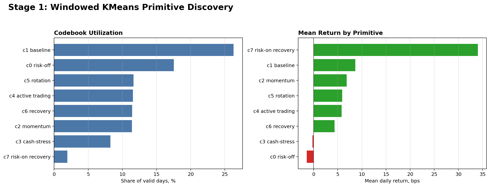

# Stage 1: Primitive Discovery

Self-supervised discovery of strategy primitives in the frozen CHRL policy hidden state.

## Result

| Metric | Value |
|---|---:|
| K | 8 |
| Utilization | 1.000 |
| Perplexity | 6.914 |
| Median run length | 18.0 trading days |
| Cross-fold NMI | 0.634 |
| Recon / variance | 0.803 |

## Primitive Summary

| code | n | freq | mean_return | mean_vix | mean_regime_p1 |
| --- | --- | --- | --- | --- | --- |
| c0 risk-off | 527 | 0.1755 | -0.0001 | -0.1699 | 0.6406 |
| c1 baseline | 789 | 0.2627 | 0.0009 | -0.6009 | 0.8189 |
| c2 momentum | 342 | 0.1139 | 0.0007 | -0.9121 | 0.8307 |
| c3 cash-stress | 248 | 0.0826 | -0.0000 | 1.6249 | -1.2429 |
| c4 active trading | 347 | 0.1156 | 0.0006 | 0.1263 | -1.1667 |
| c5 rotation | 349 | 0.1162 | 0.0006 | 0.5922 | -1.2156 |
| c6 recovery | 343 | 0.1142 | 0.0004 | 0.4133 | -0.9896 |
| c7 risk-on recovery | 58 | 0.0193 | 0.0034 | 2.7624 | -1.2485 |

## Evidence Files

- `results/stage1/code_summary.csv`
- `results/stage1/stage1_metrics_selected_k.csv`
- `results/stage1/stage1_metrics.csv`
- `results/stage1/train_codes.parquet`

Large behavior logs are excluded.

## Related Projects

- CHRL model source: [`Sqaard/CHRL-Constrained-Hierarchical-Reinforcement-Learning`](https://github.com/Sqaard/CHRL-Constrained-Hierarchical-Reinforcement-Learning)
- Main Stage 7 branch: `main`
