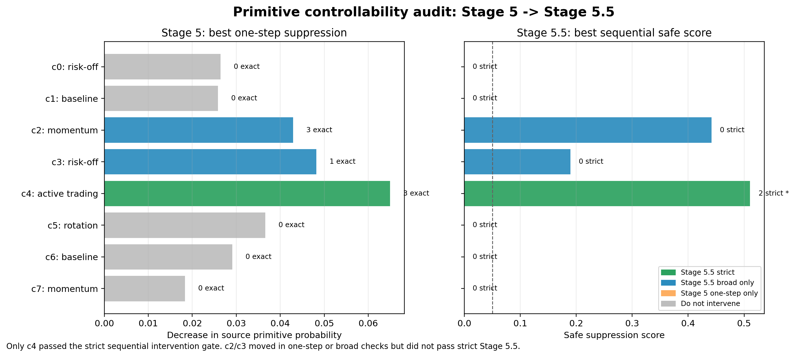

# Stage 5 / 5.5: Primitive Controllability

Stage 5 tests one-step hidden-state interventions. Stage 5.5 repeats the test over multi-day windows.

## Result

## Controllability Summary

| code_id | label | stage4_sharpe | best_one_step_source_suppression | best_stage55_safe_score | stage55_strict_count | status |
| --- | --- | --- | --- | --- | --- | --- |
| 0 | risk_off_deleveraging | -0.2870 | 0.0265 | 0.0000 | 0 | Do not intervene |
| 1 | baseline_hold | 3.0259 | 0.0259 | 0.0000 | 0 | Do not intervene |
| 2 | momentum_trend_following | 2.6028 | 0.0429 | 0.4416 | 0 | Stage 5.5 broad only |
| 3 | risk_off_deleveraging | -0.0227 | 0.0482 | 0.1897 | 0 | Stage 5.5 broad only |
| 4 | active_trading | 1.5018 | 0.0649 | 0.5107 | 2 | Stage 5.5 strict |
| 5 | sector_or_group_rotation | 1.6522 | 0.0366 | 0.0000 | 0 | Do not intervene |
| 6 | baseline_hold | 0.8433 | 0.0291 | 0.0000 | 0 | Do not intervene |
| 7 | momentum_trend_following | 2.8632 | 0.0184 | 0.0000 | 0 | Do not intervene |

Key result: only code 4, active trading, passed the strict sequential intervention gate.

## Evidence Files

- `results/stage5/stage5_intervention_arms.csv`
- `results/stage5/stage5_gate_decisions.csv`
- `results/stage5_5/stage55_schedule_summary.csv`
- `results/stage5_5/stage55_window_responses.csv`
- `results/stage5/STAGE5_ONE_STEP_CAUSAL_AUDIT.md`
- `results/stage5_5/STAGE55_SEQUENTIAL_RESPONSE_AUDIT.md`

## Related Projects

- CHRL model source: [`Sqaard/CHRL-Constrained-Hierarchical-Reinforcement-Learning`](https://github.com/Sqaard/CHRL-Constrained-Hierarchical-Reinforcement-Learning)
- Main Stage 7 branch: `main`
