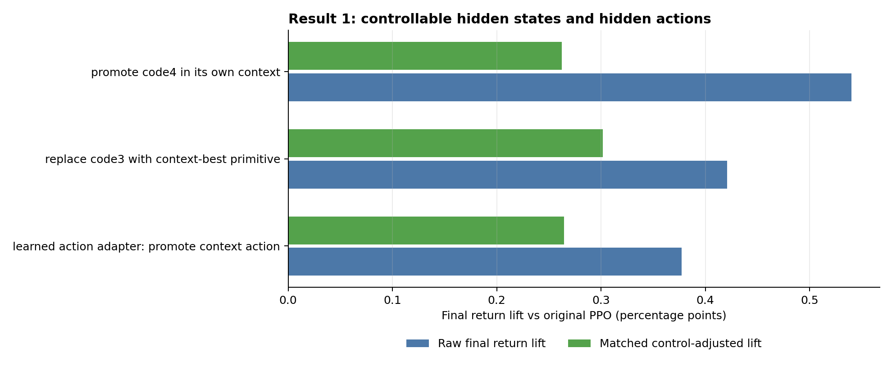
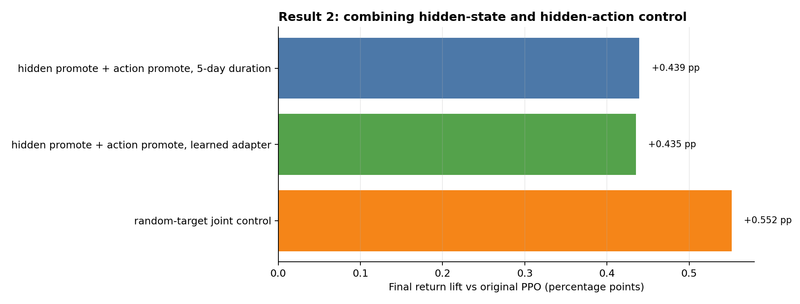
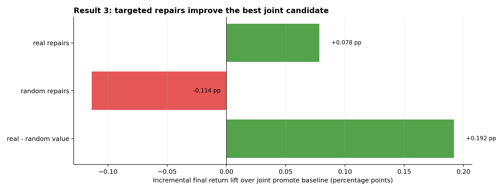
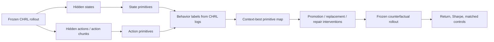

# Interpretable CHRL

Self-supervised strategy discovery and intervention for a constrained hierarchical RL trading policy.

The trading model is the **CHRL model** produced in [`Sqaard/CHRL-Constrained-Hierarchical-Reinforcement-Learning`](https://github.com/Sqaard/CHRL-Constrained-Hierarchical-Reinforcement-Learning). This repository focuses on what happens after the trading model is frozen: discover latent strategy primitives, connect them to real portfolio behavior, and test whether those primitives can be controlled in a 2022-2023 out-of-sample rollout.

## Abstract

I tested whether an RL trading policy's latent behavior is only descriptive, or whether it can become a control surface.

The answer is yes, but with an important nuance. Hidden-state primitives and hidden-action primitives are both controllable. Combining them helps. The strongest result came from **contextual repair**: keep the best hidden/action promotion candidate, then repair specific failure modes only when they appear.

Best compact result:

```text
0.508 percentage points final return vs original frozen PPO
+0.046 Sharpe
+0.192 percentage points repair value vs matched random repair control
```

All numbers below are measured on the frozen 2022-2023 CHRL rollout. The repository keeps compact evidence files only, not the full daily counterfactual logs.

## Result 1: Hidden States And Hidden Actions Are Control Surfaces



| Surface | Intervention | Raw return lift | Matched control-adjusted lift | Sharpe lift |
|---|---|---:|---:|---:|
| Hidden state | Promote code4 in its own context | +0.540 pp | +0.263 pp | +0.049 |
| Hidden state | Replace code3 with the context-best primitive | +0.421 pp | +0.302 pp | +0.039 |
| Hidden action | Learned action adapter promotes the context action | +0.377 pp | +0.265 pp | +0.036 |

What this means:

- Hidden states describe the model's internal behavioral mode.
- Hidden actions describe the portfolio move the model is about to make.
- Both can be steered without retraining the original PPO policy.
- Matched random controls are necessary because random latent edits can also move returns.


The model has two useful steering wheels. One controls the model's "mood" (`hidden state`), and one controls what its hands are about to do in the portfolio (`hidden action`). Both wheels work, but we still compare against random steering so we do not fool ourselves.

## Result 2: Hidden State + Hidden Action Control Works Better Together



| Candidate | Type | Raw return lift | Sharpe lift | Note |
|---|---|---:|---:|---|
| Hidden promote + action promote, 5-day duration | Deployable joint intervention | +0.439 pp | +0.040 | Best duration-based joint candidate |
| Hidden promote + action promote, learned adapter | Deployable joint adapter | +0.435 pp | +0.040 | Neural adapter without target-alpha leakage |
| Random-target joint control | Control / caution | +0.552 pp | +0.049 | Strong control, so raw lift alone is not enough |

What this means:

- Combining hidden states and hidden actions produces a stable positive deployable signal.
- The raw joint result is not automatically a causal proof, because one random-target control is even stronger.
- This is why later stages focus on targeted, matched repairs instead of simply reporting the largest raw backtest lift.


One wheel tells us the strategy mode; the other tells us the actual trade shape. Turning both together is useful, but a lucky random nudge can also help. So the honest question becomes: which specific fixes still help after the random nudge test?

## Result 3: Targeted Multi-Code Repairs Improve The Best Candidate



| Candidate | Role | Raw return lift | Sharpe lift | Incremental lift over joint baseline |
|---|---|---:|---:|---:|
| Joint promote baseline | Baseline | +0.429 pp | +0.040 | +0.000 pp |
| Joint promote + hidden code3 repair + action code43 repair | Targeted repairs | +0.508 pp | +0.046 | +0.078 pp |
| Joint promote + both random repairs | Matched random repair control | +0.316 pp | +0.031 | -0.114 pp |
| Real repairs minus both-random repair control | Control-adjusted repair value | - | - | +0.192 pp |

What this means:

- Generic promotion was already useful.
- Adding targeted repairs improved it further.
- Random repairs hurt the same baseline, while real repairs helped.
- The repair value is therefore not just "more intervention"; it is intervention aimed at specific failure modes.


Do not just tell the child, "stop doing bad things." First show what to do in the current situation. Then, if one very specific mistake appears, fix exactly that mistake without changing the whole personality.

## Method In One Picture



## Evidence Files

The repository keeps only compact evidence and reproducible plotting code. Full daily counterfactual logs are intentionally excluded because they are large and not needed for this public evidence package.

| File | Purpose |
|---|---|
| [`results/scientific_results/result1_hidden_state_action_control.csv`](results/scientific_results/result1_hidden_state_action_control.csv) | Result 1 compact table |
| [`results/scientific_results/result2_joint_hidden_action_control.csv`](results/scientific_results/result2_joint_hidden_action_control.csv) | Result 2 compact table |
| [`results/scientific_results/result3_targeted_multicode_repairs.csv`](results/scientific_results/result3_targeted_multicode_repairs.csv) | Result 3 compact table |
| [`scripts/plot_scientific_results.py`](scripts/plot_scientific_results.py) | Rebuilds all three result figures and tables |
| [`results/stage7/stage7_counterfactual_summary.csv`](results/stage7/stage7_counterfactual_summary.csv) | Earlier hidden-state Stage 7 candidate summary |
| [`results/stage7/stage7_control_adjusted_results.csv`](results/stage7/stage7_control_adjusted_results.csv) | Earlier hidden-state matched random controls |
| [`results/stage7/STAGE7_CODE_SANITY_AUDIT.md`](results/stage7/STAGE7_CODE_SANITY_AUDIT.md) | Implementation checks for Stage 7 |

## Why This Matters

The project turns "interpretability" into an executable test. A primitive is not considered meaningful only because it has a nice label. It must also pass a counterfactual question:

```text
If we move the model toward or away from this primitive, does portfolio behavior change in the expected direction?
```

That is the core result: latent primitives can be discovered, named from trading logs, and used as intervention handles.

## Limitations

- This is frozen-rollout counterfactual analysis, not a live trading system.
- Controls matter: some random latent edits improve metrics too.
- The 2022-2023 split is stress-heavy, so the strongest evidence is for stress/recovery behavior.
- Full daily logs are excluded from this repository; compact summary files and plotting scripts are included.

## Related Projects

- CHRL model source: [`Sqaard/CHRL-Constrained-Hierarchical-Reinforcement-Learning`](https://github.com/Sqaard/CHRL-Constrained-Hierarchical-Reinforcement-Learning)
- Earlier RL feature ablation project: [`Sqaard/RL-based-Feature-Ablation`](https://github.com/Sqaard/RL-based-Feature-Ablation)
