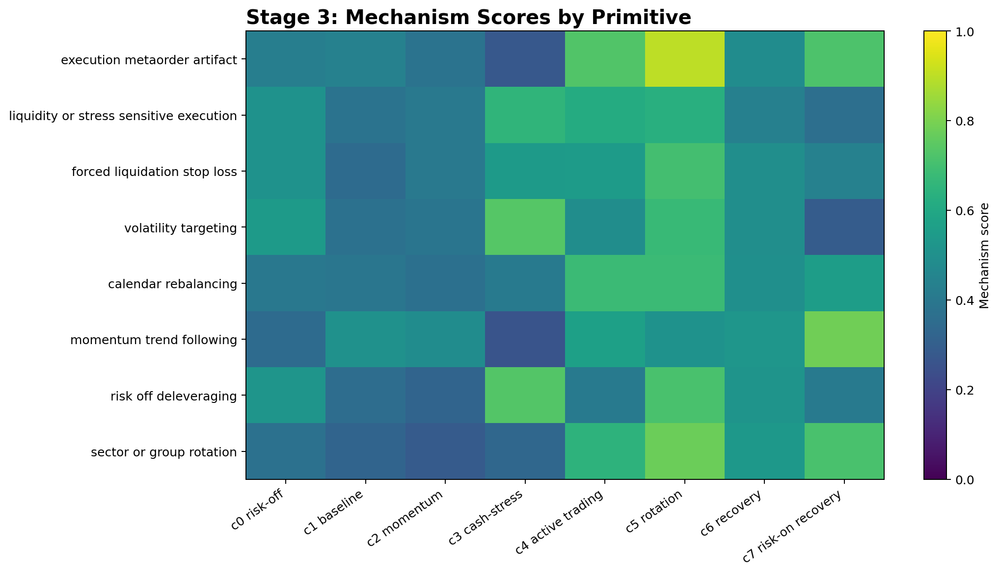

# Stage 3: Mechanism Labeling

Stage 3 converts primitive clusters into human-readable trading mechanisms using multiple weak labeling views.

## Result

## Primitive Labels

| code_id | final_label | label_strength | method_agreement_count | top_mechanisms | rationale |
| --- | --- | --- | --- | --- | --- |
| 0 | risk_off_deleveraging | strong | 4 | volatility_targeting:0.547; risk_off_deleveraging:0.520; forced_liquidation_stop_loss:0.510 | cash=0.187; q=0.813; stress=0.474; recovery=0.462; turnover=0.0017; VIX=-0.170; SP500Trend=-0.219; residual20=-0.482 |
| 1 | baseline_hold | strong | 3 | baseline_hold:0.554; short_term_reversal_recovery:0.532; momentum_trend_following:0.505 | cash=0.178; q=0.822; stress=0.428; recovery=0.538; turnover=0.0016; VIX=-0.601; SP500Trend=0.280; residual20=0.333 |
| 2 | momentum_trend_following | strong | 3 | baseline_hold:0.496; momentum_trend_following:0.488; crowding_or_concentration:0.429 | cash=0.151; q=0.849; stress=0.451; recovery=0.504; turnover=0.0012; VIX=-0.912; SP500Trend=0.436; residual20=0.070 |
| 3 | risk_off_deleveraging | strong | 5 | volatility_targeting:0.736; risk_off_deleveraging:0.731; liquidity_or_stress_sensitive_execution:0.654 | cash=0.208; q=0.792; stress=0.493; recovery=0.439; turnover=0.0018; VIX=1.625; SP500Trend=-1.414; residual20=-0.987 |
| 4 | active_trading | strong | 4 | execution_metaorder_artifact:0.728; active_trading:0.705; calendar_rebalancing:0.682 | cash=0.155; q=0.845; stress=0.452; recovery=0.505; turnover=0.0060; VIX=0.126; SP500Trend=0.683; residual20=0.194 |
| 5 | sector_or_group_rotation | strong | 3 | execution_metaorder_artifact:0.899; active_trading:0.805; sector_or_group_rotation:0.776 | cash=0.209; q=0.791; stress=0.458; recovery=0.476; turnover=0.0060; VIX=0.592; SP500Trend=1.409; residual20=-0.387 |
| 6 | baseline_hold | tentative | 2 | short_term_reversal_recovery:0.556; active_trading:0.553; sector_or_group_rotation:0.532 | cash=0.205; q=0.795; stress=0.414; recovery=0.553; turnover=0.0032; VIX=0.413; SP500Trend=-0.541; residual20=0.250 |
| 7 | momentum_trend_following | strong | 4 | short_term_reversal_recovery:0.838; crowding_or_concentration:0.806; momentum_trend_following:0.782 | cash=0.118; q=0.882; stress=0.321; recovery=0.691; turnover=0.0040; VIX=2.762; SP500Trend=-1.819; residual20=1.498 |

## Evidence Files

- `results/stage3/primitive_labels.csv`
- `results/stage3/mechanism_scores.csv`
- `results/stage3/label_uncertainty.csv`
- `results/stage3/STAGE3_R6C_MECHANISM_LABELING.md`

## Related Projects

- CHRL model source: [`Sqaard/CHRL-Constrained-Hierarchical-Reinforcement-Learning`](https://github.com/Sqaard/CHRL-Constrained-Hierarchical-Reinforcement-Learning)
- Main Stage 7 branch: `main`
