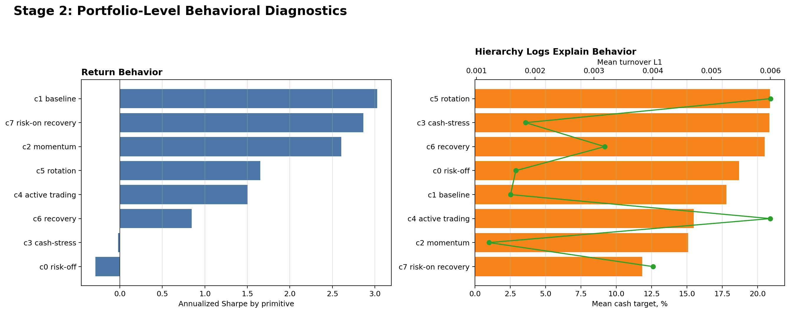

# Stage 2: Behavioral Diagnostics

Stage 2 joins primitives back to CHRL portfolio logs: cash/risk layer, Top-K execution, confidence scores, turnover, and market context.

## Result

## Top Primitive Behavior

| code | ann_sharpe_net_return | mean_cash_target | mean_turnover_l1 | mean_risk_stress | mean_recovery_score |
| --- | --- | --- | --- | --- | --- |
| c1 baseline | 3.0259 | 0.1780 | 0.0016 | 0.4282 | 0.5378 |
| c7 risk-on recovery | 2.8632 | 0.1184 | 0.0040 | 0.3212 | 0.6912 |
| c2 momentum | 2.6028 | 0.1510 | 0.0012 | 0.4509 | 0.5044 |
| c5 rotation | 1.6522 | 0.2088 | 0.0060 | 0.4584 | 0.4761 |
| c4 active trading | 1.5018 | 0.1548 | 0.0060 | 0.4522 | 0.5054 |
| c6 recovery | 0.8433 | 0.2050 | 0.0032 | 0.4139 | 0.5532 |
| c3 cash-stress | -0.0227 | 0.2084 | 0.0018 | 0.4929 | 0.4387 |
| c0 risk-off | -0.2870 | 0.1870 | 0.0017 | 0.4743 | 0.4622 |

## Evidence Files

- `results/stage2/stage2_primitive_behavior_summary.csv`
- `results/stage2/stage2_primitive_labels.csv`
- `results/stage2/stage2_primitive_transition_probs.csv`
- `results/stage2/STAGE2_R6C_BEHAVIOR_DIAGNOSTICS.md`

Daily diagnostics are excluded because they are large.

## Related Projects

- CHRL model source: [`Sqaard/CHRL-Constrained-Hierarchical-Reinforcement-Learning`](https://github.com/Sqaard/CHRL-Constrained-Hierarchical-Reinforcement-Learning)
- Main Stage 7 branch: `main`
