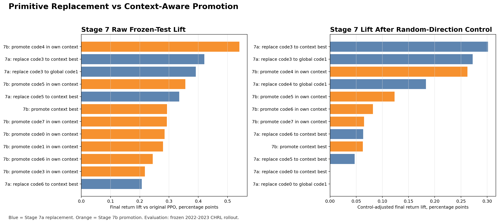
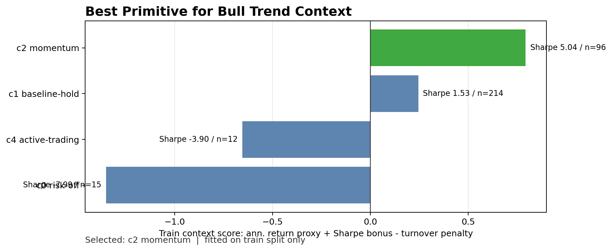
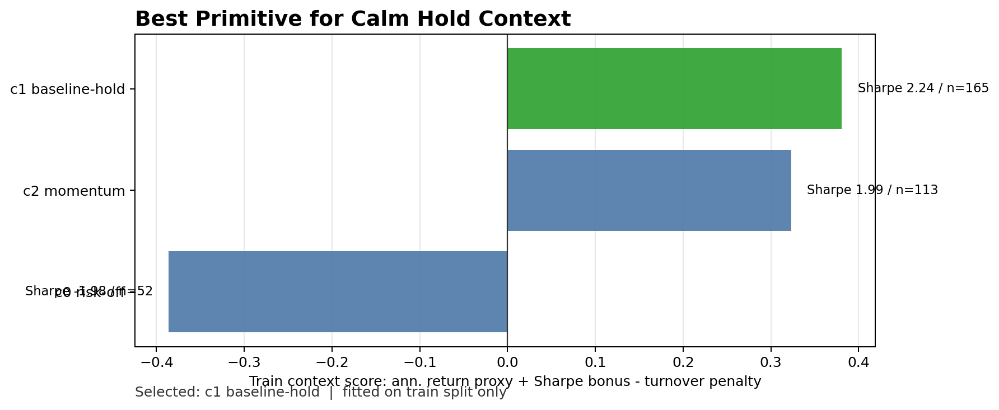
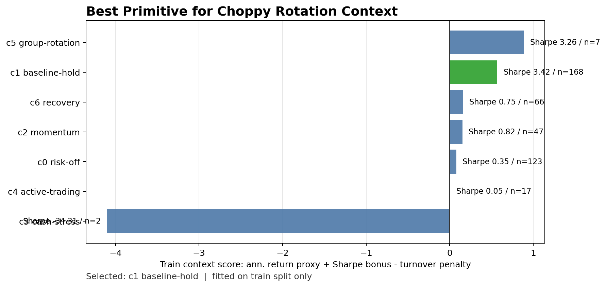
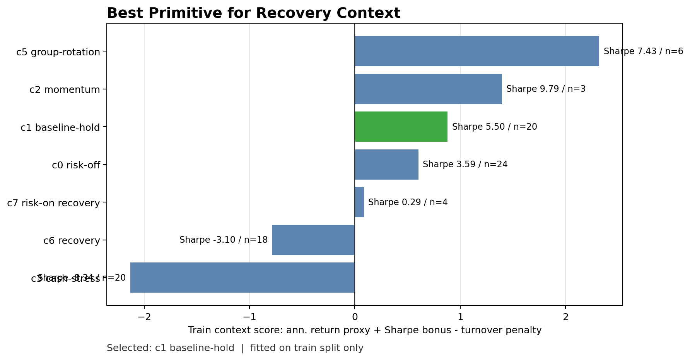
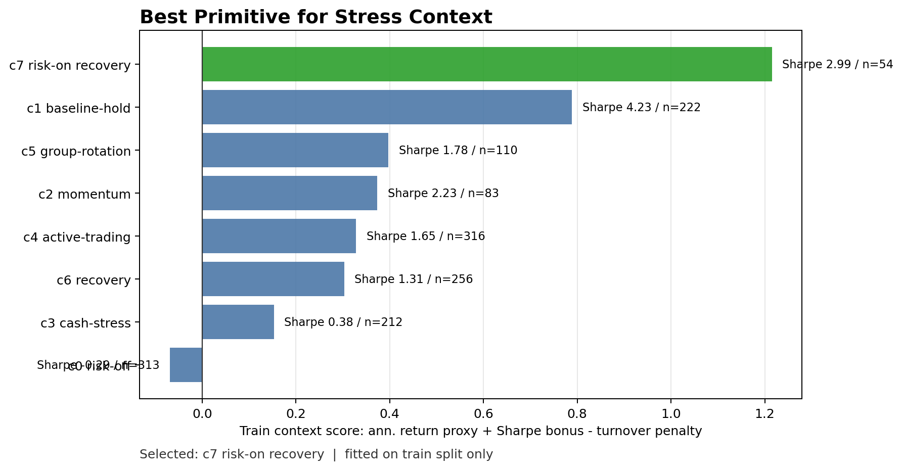
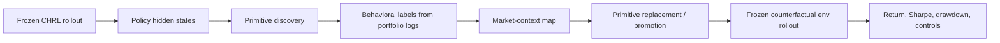

# Interpretable CHRL

Self-supervised strategy discovery and hidden-state intervention for a constrained hierarchical reinforcement-learning trading policy.

The policy used here is the **CHRL model** produced in [`Sqaard/CHRL-Constrained-Hierarchical-Reinforcement-Learning`](https://github.com/Sqaard/CHRL-Constrained-Hierarchical-Reinforcement-Learning). This repository focuses on the interpretation layer: discovering strategy primitives, mapping them to market regimes, and testing whether primitive-level interventions can improve a frozen out-of-sample rollout.

## Abstract

Most RL trading policies are hard to explain because the actual decision is buried inside hidden states. I treated the policy hidden state as a behavioral space, discovered recurring strategy primitives with self-supervised clustering, and then tested whether those primitives are merely descriptive or actually controllable.

The strongest result is that primitive-aware hidden-state editing can improve a frozen 2022-2023 rollout without retraining the PPO model. The best control-adjusted intervention was:

```text
Replace code 3 with the best primitive for the current market context
Control-adjusted final return lift: +0.302 percentage points
Control-adjusted Sharpe lift:       +0.030
```

The result is intentionally reported with random-direction controls. The goal is not to claim magic latent steering, but to separate real primitive effects from the fact that any hidden-state edit can sometimes move the portfolio.

## Current Results



| Candidate | Idea | Raw final return lift | Control-adjusted lift | Sharpe lift |
|---|---:|---:|---:|---:|
| `stage7a_replace_code3_to_context_best` | Replace a stress-like primitive with the train-best primitive for the current context | +0.421 pp | **+0.302 pp** | +0.039 |
| `stage7a_replace_code3_to_global_code1` | Replace code 3 with the globally strong baseline-hold primitive | +0.392 pp | +0.273 pp | +0.037 |
| `stage7b_promote_code4_in_own_context` | Promote active-trading behavior only in its own context | **+0.540 pp** | +0.263 pp | **+0.049** |
| `stage7b_promote_code5_in_own_context` | Promote group-rotation behavior in its own context | +0.355 pp | +0.123 pp | +0.034 |

Key interpretation:

- Code 3 appears to be replaceable in stress-like frozen-test windows.
- Code 4 is not simply a "bad primitive". It can help when promoted in the right context.
- Context-aware replacement beats naive suppression as an interpretation-and-control mechanism.
- Random controls still explain part of the lift, so the causal claim is deliberately conservative.

## Best Primitive by Market Context

The context map is fitted on train rows only, then evaluated on the frozen 2022-2023 rollout.

| Market context | Selected primitive | Interpretation |
|---|---:|---|
| `bull_trend` | code 2 | momentum / risk-on behavior |
| `calm_hold` | code 1 | baseline holding behavior |
| `choppy_rotation` | code 1 | stable hold beats noisy rotation in train scoring |
| `recovery` | code 1 | baseline hold was the safest train winner |
| `stress` | code 7 | risk-on recovery / top-k reopening behavior |

### Bull Trend



### Calm Hold



### Choppy Rotation



### Recovery



### Stress



## Method



The current Stage 7 experiment has two intervention families:

| Stage | Question | Example |
|---|---|---|
| Stage 7a | Should a source primitive be replaced by a better primitive? | `code3 -> context-best` |
| Stage 7b | Should a good primitive be promoted only in the context where it is useful? | `promote code4 in own context` |

All Stage 7 candidates are evaluated through the real frozen environment step, not by estimating returns from logs.

## Evidence Files

The repository keeps only compact evidence, not the full 200 MB daily counterfactual logs.

| File | Purpose |
|---|---|
| [`results/stage7/stage7_counterfactual_summary.csv`](results/stage7/stage7_counterfactual_summary.csv) | Raw frozen-test performance for every Stage 7 candidate |
| [`results/stage7/stage7_control_adjusted_results.csv`](results/stage7/stage7_control_adjusted_results.csv) | Candidate lift after matching random-direction controls |
| [`results/stage7/stage7_context_best_map.csv`](results/stage7/stage7_context_best_map.csv) | Train-fitted market-context to best-primitive map |
| [`results/stage7/stage7_primitive_context_profile.csv`](results/stage7/stage7_primitive_context_profile.csv) | Per-context primitive scoring table |
| [`results/stage7/STAGE7_CODE_SANITY_AUDIT.md`](results/stage7/STAGE7_CODE_SANITY_AUDIT.md) | Implementation checks and leakage guards |
| [`scripts/plot_stage7_contextual_results.py`](scripts/plot_stage7_contextual_results.py) | Rebuilds the README figures from Stage 7 summary files |

## What This Shows

The primitive space is not only descriptive. It can be used as a control surface.

The most important lesson is subtle: the best strategy is not "kill bad primitives". Some primitives are bad only when they appear in the wrong context. The better move is to ask:

```text
Which primitive should this market regime use right now?
```

Then either:

- replace the current primitive with the context-best primitive; or
- promote the currently useful primitive more strongly.

## Limitations

- This is a frozen-test counterfactual analysis, not a production trading system.
- Random-direction controls also improve some metrics, so primitive-specific causal claims must be control-adjusted.
- The frozen 2022-2023 split is stress-heavy, so the current evidence is strongest for stress-context behavior.
- Full daily rollout logs are intentionally excluded from this repository because they are large and not needed for a resume-facing evidence package.

## Related Projects

- CHRL model source: [`Sqaard/CHRL-Constrained-Hierarchical-Reinforcement-Learning`](https://github.com/Sqaard/CHRL-Constrained-Hierarchical-Reinforcement-Learning)
- Earlier RL feature ablation project: [`Sqaard/RL-based-Feature-Ablation`](https://github.com/Sqaard/RL-based-Feature-Ablation)
