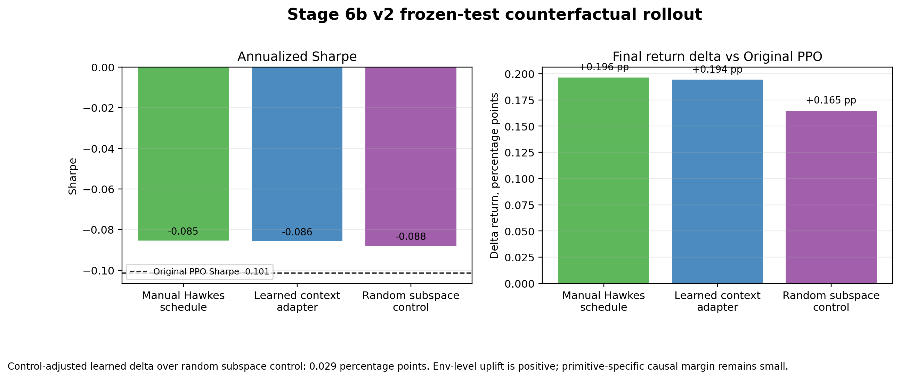

# Stage 6 / 6b: Primitive Adapter and Frozen Rollout

Stage 6 trains honest context adapters to suppress active-trading behavior in hidden space. Stage 6b evaluates those adapters through a real frozen 2022-2023 environment rollout.

## Result

## Frozen-Test Counterfactuals

| counterfactual_variant | final_return | annualized_sharpe | delta_final_return_vs_original | delta_sharpe_vs_original | mean_alpha |
| --- | --- | --- | --- | --- | --- |
| manual_stage55_hawkes_hidden_direction | -0.0173 | -0.0854 | 0.0020 | 0.0161 | 0.0105 |
| learned_context_adapter_hidden_direction | -0.0173 | -0.0857 | 0.0019 | 0.0158 | 0.0584 |
| oracle_schedule_adapter_hidden_direction | -0.0174 | -0.0864 | 0.0018 | 0.0151 | 0.0053 |
| oracle_no_bad_penalty_hidden_direction | -0.0174 | -0.0864 | 0.0018 | 0.0151 | 0.0053 |
| oracle_schedule_adapter_hidden_subspace | -0.0174 | -0.0865 | 0.0018 | 0.0150 | 0.0053 |
| oracle_no_bad_penalty_hidden_subspace | -0.0174 | -0.0865 | 0.0018 | 0.0150 | 0.0053 |
| manual_stage55_hawkes_hidden_subspace | -0.0174 | -0.0865 | 0.0018 | 0.0150 | 0.0105 |
| learned_context_adapter_hidden_subspace | -0.0174 | -0.0870 | 0.0018 | 0.0145 | 0.0570 |
| manual_random_direction_control_hidden_subspace | -0.0176 | -0.0879 | 0.0016 | 0.0135 | 0.0105 |
| learned_context_random_labels_hidden_direction | -0.0192 | -0.1014 | 0.0000 | 0.0001 | 0.0076 |

Key result: the rule-based Hawkes controller and learned context adapter both improved final return versus original PPO, but random-direction controls explain part of the lift.

## Evidence Files

- `results/stage6/stage6_adapter_window_summary.csv`
- `results/stage6/STAGE6_PRIMITIVE_ADAPTER_VALIDATION.md`
- `results/stage6/STAGE6_CODE_SANITY_AUDIT.md`
- `results/stage6b/stage6b_counterfactual_summary.csv`
- `results/stage6b/STAGE6B_COUNTERFACTUAL_ROLLOUT.md`
- `results/stage6b/STAGE6B_CODE_SANITY_AUDIT.md`

## Related Projects

- CHRL model source: [`Sqaard/CHRL-Constrained-Hierarchical-Reinforcement-Learning`](https://github.com/Sqaard/CHRL-Constrained-Hierarchical-Reinforcement-Learning)
- Main Stage 7 branch: `main`
