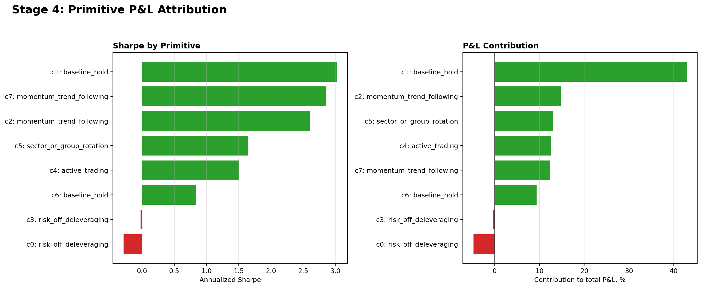

# Stage 4: Primitive P&L Attribution

Stage 4 asks whether discovered primitives are financially meaningful, not just visually separable.

## Result

## P&L Decomposition

| code_id | final_label | annualized_sharpe | contribution_to_total_pnl_pct | sum_one_period_return | max_drawdown_within_code_sequence |
| --- | --- | --- | --- | --- | --- |
| 1 | baseline_hold | 3.0259 | 0.4293 | 0.6825 | -0.0428 |
| 2 | momentum_trend_following | 2.6028 | 0.1475 | 0.2344 | -0.0431 |
| 5 | sector_or_group_rotation | 1.6522 | 0.1304 | 0.2073 | -0.0698 |
| 4 | active_trading | 1.5018 | 0.1267 | 0.2014 | -0.0724 |
| 7 | momentum_trend_following | 2.8632 | 0.1242 | 0.1974 | -0.0682 |
| 6 | baseline_hold | 0.8433 | 0.0934 | 0.1485 | -0.1162 |
| 3 | risk_off_deleveraging | -0.0227 | -0.0040 | -0.0063 | -0.2174 |
| 0 | risk_off_deleveraging | -0.2870 | -0.0476 | -0.0756 | -0.1648 |

## Evidence Files

- `results/stage4/primitive_return_decomposition.csv`
- `results/stage4/primitive_stage4_summary.csv`
- `results/stage4/primitive_mechanism_status.csv`
- `results/stage4/primitive_finance_safe_validation.csv`
- `results/stage4/STAGE4_CODE_SANITY_AUDIT.md`

## Related Projects

- CHRL model source: [`Sqaard/CHRL-Constrained-Hierarchical-Reinforcement-Learning`](https://github.com/Sqaard/CHRL-Constrained-Hierarchical-Reinforcement-Learning)
- Main Stage 7 branch: `main`
